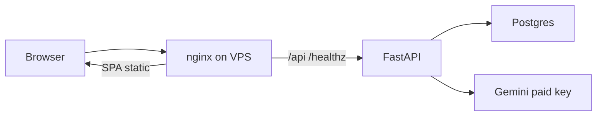

# План по ТЗ фазы 3

**Статус:** утверждён 22.09.2026. 23.09.2026 сделан код приоритета 1 (basic auth на `/docs`, терминал только в dev, обязательное сохранение seed-фразы) и код приоритета 2 (два секрета, fail-fast, PII по содержимому, npm). В тот же день Бакыт закрыл запасной канал восстановления: в этот заход не делаем. 26.09.2026 Vercel закрыт: сайт, API и Postgres на одном VPS. Боевой Compose в репозитории. Сам сервер, платный Gemini и набор пользователей ещё не сделаны.

**Источник:** [NotMice_TZ_Faza3.md](NotMice_TZ_Faza3.md). Календарь из [PLAN.md](PLAN.md) всё ещё актуален по датам: гейт 05.10.2026, код-фриз 10.10.2026, подача SPRIND 16.10.2026. Сегодня 22.09 — в коде успеваем приоритеты 1 (кроме набора пользователей) и точечный приоритет 2. Приоритет 3 до фриза не трогаем.

ТЗ фазы 3: сайт, API и Postgres на одном VPS, без Vercel. В репозитории есть dev Compose и боевой Compose. До питча SPRIND не закрыты сам сервер, платный Gemini и живые opt-in записи. План делит работу на код в репозитории, решения команды и то, что сознательно откладывается после гранта.

## Что ТЗ описывает верно

- Backend — FastAPI, сессии извлечения и rate limit живут в памяти процесса ([app/core/rate_limit.py](../app/core/rate_limit.py), [app/core/deps.py](../app/core/deps.py)). Postgres поднимается в [docker-compose.yml](../docker-compose.yml) и в [docker-compose.prod.yml](../docker-compose.prod.yml). Боевой файл собирает фронт и отдаёт его тем же nginx, что проксирует API. `VITE_API_BASE_URL` пустой: сайт и API на одном origin ([src/api/accounts.ts](../src/api/accounts.ts) и соседние клиенты). Отдельного хоста под фронт нет.
- `Argon2SeedHasher` и `JwtTokenIssuer` берут один `settings.secret_key` ([app/core/deps.py](../app/core/deps.py)). Дефолт `dev-insecure-change-me-not-for-prod` зашит и в [app/core/config.py](../app/core/config.py), и в compose.
- `reject_pii` смотрит только на имена ключей ([app/domain/pii.py](../app/domain/pii.py)). Строка с email или телефоном внутри `raw_name` / `lab_name` проходит.
- В корне лежат и [bun.lock](../bun.lock), и [package-lock.json](../package-lock.json). Поля `packageManager` нет.
- Claude Vision — заглушка, которая кидает `VisionNotConfiguredError` ([app/services/vision.py](../app/services/vision.py)).
- [PLAN.md](PLAN.md) до сих пор говорит «разработка не начата» (сверка 21.09.2026), хотя API и фронт уже работают.
- Nginx проксирует `/docs` и `/openapi.json` без авторизации ([proxy/nginx.conf](../proxy/nginx.conf)). Порт API наружу не опубликован, снаружи виден только proxy `:8080`.

## Что в ТЗ устарело или уже частично сделано

- Кнопка Run в «NotMice session log» не мёртвая: форма в [src/components/TerminalModal.tsx](../src/components/TerminalModal.tsx) принимает `help`, `status`, `loinc`, `privacy`, `cite`. Проблема в подаче: это CLI на лендинге, вход из [src/components/Header.tsx](../src/components/Header.tsx). Для питча виджет убираем из прод-сборки, а не доводим до отдельного продукта.
- Онбординг фразы уже показывает 12 слов, чекбокс и кнопку Continue, которая выключена, пока чекбокс пуст ([src/components/SeedPhraseModal.tsx](../src/components/SeedPhraseModal.tsx)). Дыры: нет скачивания файлом; крестик закрывает окно без подтверждения; аккаунт и токен пишутся в [src/App.tsx](../src/App.tsx) (`handleCreateAccount`) до подтверждения, так что пользователь уже внутри продукта без сохранённой фразы.
- Резервный канал (шифрованный blob на email/Telegram) Бакыт 23.09.2026 закрыл на этот заход. На сервере остаётся только argon2id-хеш фразы, без связки с email или Telegram. Доработку восстановления переносим в бэклог после гранта.

## Приоритет 1 — до питча

**Код в этом репозитории**

1. Закрыть документацию. В [proxy/nginx.conf](../proxy/nginx.conf) повесить basic auth на `/docs` и `/openapi.json`. Пароль не коммитить: файл htpasswd из env на старте proxy. `/api/` и `/healthz` остаются открытыми. Тест: без заголовка Authorization эти два пути отдают 401, API — нет.
2. Убрать дебаг-терминал с прод-лендинга. Скрыть кнопку в хедере и не монтировать `TerminalModal`, когда `import.meta.env.PROD`. В `vite dev` оставить как есть.
3. Доделать seed-онбординг в [src/components/SeedPhraseModal.tsx](../src/components/SeedPhraseModal.tsx) и [src/App.tsx](../src/App.tsx):
   - скачивание `notmice-recovery-phrase.txt` (только фраза, без медданных);
   - Continue активна только после чекбокса и после скачивания или явного копирования;
   - крестик и клик снаружи не закрывают окно, пока фраза на экране;
   - токен в `localStorage` пишется после подтверждения, не в момент `createAccount`.

   Резервный email/Telegram не делаем: решение Бакыта от 23.09.2026, см. приоритет 3.

**Не код, блокеры питча — нужны Андрей и доступ к аккаунтам**

4. Хостинг. Dev Compose поднимает `postgres` + `api` + nginx без статики. Боевой [docker-compose.prod.yml](../docker-compose.prod.yml) на одном VPS поднимает `postgres` + один контейнер `api` + nginx, который отдаёт собранный фронт и проксирует API. Vercel закрыт, отдельный хост фронта не используем. На сервере: реальные `SEED_HASH_SECRET` и `JWT_SECRET` (разные, каждый от 32 символов, без префикса `dev-insecure`), `APP_ENV=production`, `POSTGRES_PASSWORD`, `GEMINI_API_KEY`, `CORS_ORIGINS` = публичный адрес VPS. `VITE_API_BASE_URL` пустой, сайт и API на одном origin. Секреты только в env хоста. Один контейнер API: rate limit в памяти процесса, несколько реплик не поднимать. HTTPS — когда появится домен, перед тем же nginx.
5. Платный Gemini-ключ. В репозитории ключ не хранится. Включить billing в Google Cloud, выпустить ключ в AI Studio, положить в env хоста. Бесплатный ключ на питч не оставлять: [.env.example](../.env.example) уже предупреждает, что free-tier может уйти в обучение моделей.
6. 20–30 живых opt-in записей. Фейковые медданные в БД не сидим. После того как боевой Compose на VPS отдаёт сайт и API с одного адреса, люди регистрируются, подтверждают панель и включают public sharing. Проверка питча: `GET /api/v1/dataset` возвращает строки, не пустой массив.

## Приоритет 2 — техдолг до фриза, без Redis

- Развести ключи. Два env: `SEED_HASH_SECRET` (argon2 pepper) и `JWT_SECRET` (подпись). Оба обязательны, не равны друг другу. Проброс в [app/core/config.py](../app/core/config.py), [app/core/deps.py](../app/core/deps.py), [docker-compose.yml](../docker-compose.yml), [.env.example](../.env.example). Старый единый `SECRET_KEY` для этих двух целей убрать. Тесты в [app/tests/test_security.py](../app/tests/test_security.py) и [app/tests/test_accounts.py](../app/tests/test_accounts.py) уже создают hasher и issuer разными строками — прод должен вести себя так же.
- Fail-fast на проде. При `APP_ENV=production` процесс не стартует, если секрет равен `dev-insecure-change-me-not-for-prod`, пустой или короче 32 символов. Проверка в `lifespan` ([app/main.py](../app/main.py)). Локальный compose и CI остаются на не-prod.
- PII по содержимому. В [app/domain/pii.py](../app/domain/pii.py) дополнительно сканировать строковые значения: email и телефон — жёстко; ФИО — узкий шаблон (2–3 слова с заглавной, кириллица или латиница) только в свободных полях вроде `raw_name`, `lab_name`, заметок. `Quest Diagnostics` и `Serum Albumin` должны проходить — это уже зафиксировано в [app/tests/test_pii.py](../app/tests/test_pii.py). Новые тесты: email и телефон внутри `raw_name` отклоняются.
- Один пакетный менеджер: **npm**. Ошибка ERESOLVE при сборке фронта была npm-овская. Удалить [bun.lock](../bun.lock), оставить [package-lock.json](../package-lock.json). В `package.json` при необходимости указать `"packageManager": "npm@..."`. Боевой образ фронта собирается через `npm ci`.
- Redis / общий rate limit не делаем. В комментарии к limiter уже сказано, что окно живёт в одном процессе. Для одного контейнера на питче этого хватает. В плане деплоя явно: не поднимать несколько реплик API.

## Приоритет 3 — после гранта, в этот заход не код

- Запасной канал восстановления. Решение Бакыта 23.09.2026: blob на email/Telegram в этот заход не делаем. На сервере строго argon2id-хеш фразы, без связки с контактными данными — так держим код-фриз и абсолютную псевдонимность. Методы восстановления возвращаем в бэклог после гранта, не раньше.
- PQC-TLS: решение с Бакытом записать в доке (возвращаем как отличительную фичу или сознательно снимаем). Код не возвращать до решения.
- Claude Vision: оставить заглушку. Второй провайдер не блокер питча.
- GitHub-организация: ruleset на `main`, 2FA, удаление личного репозитория после переноса — действия в GitHub, не в этом дереве. CI бэкенда уже есть: [.github/workflows/backend.yml](../.github/workflows/backend.yml).
- Документация: короткая правка статуса в [PLAN.md](PLAN.md) — «фаза 2 в коде, управляющий документ фазы 3 — NotMice_TZ_Faza3.md». Полный перепис архитектуры не нужен до фриза. Это дёшево и убирает формулировку «разработка не начата» для нового человека в команде, хотя ТЗ положило пункт в приоритет 3.

## Порядок работ

Сначала код, который не зависит от хоста: nginx auth, терминал, seed-фраза, два секрета, fail-fast, PII, удаление `bun.lock`, строка статуса в PLAN.md, боевой Compose со статикой фронта. Потом чеклист для Андрея: сам VPS, paid Gemini, набор 20–30 пользователей. Redis, Claude, PQC и GitHub-организацию в этот заход не включаем.

## Чеклист

- [x] Basic auth на `/docs` и `/openapi.json` в nginx, секрет из env
- [x] Скрыть NotMice session log в production-сборке
- [x] Скачивание фразы, блок закрытия модалки, токен только после подтверждения
- [x] `SEED_HASH_SECRET` и `JWT_SECRET`, fail-fast в production
- [x] Проверка email, телефона и ФИО в текстовых полях, плюс тесты
- [x] Удалить `bun.lock`, зафиксировать npm
- [x] Обновить статус в `docx/PLAN.md`
- [x] Запасной канал восстановления не делаем (решение Бакыта 23.09.2026)
- [x] Боевой Compose: один VPS, nginx отдаёт фронт и API, без Vercel
- [ ] Сам VPS, платный Gemini-ключ, 20–30 живых opt-in
