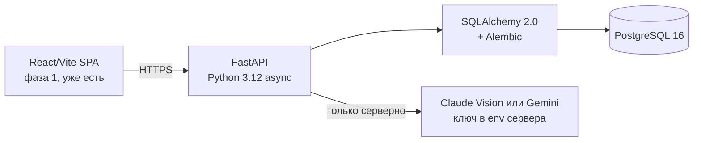

# NotMice: ТЗ Фаза 2 — бэкенд поверх демо-фронтенда
*Sep 20, 2026 · @Someone*

Бактыбек подтвердил: то, что крутится на `notmice.ai.studio`, — фронтенд-демо на захардкоженных фикстурах, без единого байта бэкенда; это ТЗ фиксирует, что должно встать под него к 10.10, чтобы 16.10 подавать заявку с работающим, а не бутафорским конвейером данных.

---

## 1. Вердикт

Бактыбек подтвердил письменно (18.09): на экране `notmice.ai.studio` нет ни одного реального байта данных. Все цифры — захардкоженные фикстуры в `src/data/phenoAgeData.ts` (`INITIAL_BIOMARKERS`, `INITIAL_HISTORY`, `PRESET_LAB_PANELS`). Загрузка PDF ничего не парсит: `UploadLabTab` крутит `setTimeout` и подставляет пресет Quest независимо от содержимого файла. IPFS CID — константа-заглушка. «Криптографический хеш» — самодельный integer-hash с префиксом `0x`, не SHA-256. Экспорт JSON/CSV просто выгружает браузерный state.

Это не брак и не саботаж. Это ровно то, что и должен производить шаблон Google AI Studio: витрину интерфейса за один проход генерации. Проблема в другом — витрину приняли (никем не озвученную вслух) за прогресс по модулям 1-2 исходного ТЗ, хотя backend, ради которого эти модули существуют, не начат.

Хорошая новость: Бактыбек сам это диагностировал точно и предложил план, который совпадает с исходным ТЗ почти дословно — **FastAPI + PostgreSQL + Alembic**, без IPFS/ZK/WASM-декораций. В репозитории уже лежат `docx/TZ_MVP_28_DAYS.md`, `docx/TECHNICAL_ARCHITECTURE.md` и `docx/PLAN.md` — markdown-версии вашего документа от 18.09, то есть базовое ТЗ он читал и разделяет. Расхождение не в понимании цели, а в том, что React/Vite-фронтенд из AI Studio уже существует и работает как витрина, а backend под ним — нет.

Это ТЗ фиксирует, что именно достраивается за оставшиеся до код-фриза (10.10) 20 дней, и какие два пункта архитектуры требуют вашего решения, а не решения Бактыбека в одиночку (раздел 3).

---

## 2. Модель данных и приватность

Формулировка **«Zero Cloud Retention»** снимается с лендинга и со всех материалов заявки. Она была честна только пока бэкенду было некуда писать. С модуля 3 она станет неправдой: по исходному ТЗ подтверждённые значения должны оседать в PostgreSQL — иначе нет датасета, который мы обещаем SPRIND.

Точная формулировка для кода, для сайта и для хартии данных:

| Что | Статус |
| :--- | :--- |
| **Оригинал файла (PDF/фото)** | Никогда не пишется на диск, обрабатывается только в RAM, уничтожается сразу после подтверждения |
| **SHA-256 хеш оригинала** | Хранится в provenance — настоящий SHA-256, не самодельный integer-hash |
| **Подтверждённые значения биомаркеров** | Хранятся в Postgres с согласия пользователя, привязаны к псевдонимному ID, не к ФИО |
| **Имя, дата рождения, номер пациента** | Не собираются вообще — PII-валидаторы из `schemas_public.py` отсекают на входе и на выходе |
| **Публичный агрегат (opt-in)** | Отдаётся через `/api/v1/dataset` только для профилей с явно включённой публичностью |

Сайт и заявка говорят: *«оригиналы документов не хранятся, структурированные значения хранятся с согласия, для исследовательского и коммерческого переиспользования обезличенных агрегатов»* — это и есть формулировка для раздела о правовой основе в форме SPRIND, а не «Zero Cloud Retention».

---

## 3. Архитектура

Текущий React/Vite-фронт остаётся и становится витриной над реальным backend'ом. Схема из ответа Бактыбека:

Два решения, которые Бактыбек предлагает, но которые меняют исходный документ, и потому требуют вашего да:

| Решение | Было в ТЗ от 18.09 | Предлагает Бактыбек | Аргумент |
| :--- | :--- | :--- | :--- |
| **Фронтенд** | Astro (SSR/SSG) | Оставить React/Vite | Переписывать за 20 дней нет смысла, React уже работает |
| **Vision-модель** | Anthropic Claude API (`claude-3-5-sonnet`) | Claude или Gemini — вопрос цены/качества | Архитектурно не важно, вызов всё равно только с backend |

Обе замены технически разумны — но это решение не CTO в одиночку, потому что в заявке SPRIND есть поле про технологический стек и аргументацию выбора — менять его задним числом после подачи дороже, чем согласовать сейчас. Андрей, подтверди оба пункта — иначе считаем исходный ТЗ в силе.

---

## 4. API-контракт и схема БД

Базовые эндпоинты из ответа Бактыбека, дополненные до полного сквозного сценария из раздела 8 исходного ТЗ:

| Метод | Путь | Что делает |
| :--- | :--- | :--- |
| **POST** | `/api/v1/accounts` | Создаёт псевдонимного участника, возвращает BIP-39 seed-фразу один раз; хранится только argon2id-хеш |
| **POST** | `/api/v1/uploads/extract` | PDF/скан только в RAM $\rightarrow$ SHA-256 $\rightarrow$ pdfplumber или Vision LLM $\rightarrow$ JSON маркеров клиенту $\rightarrow$ файл уничтожается |
| **POST** | `/api/v1/uploads/confirm` | Подтверждённые значения + provenance пишутся в Postgres |
| **GET** | `/api/v1/dataset` | Read-only, rate-limit по IP, только opt-in обезличенные строки, CSV/Parquet + datasheet |
| **GET** | `/api/v1/profiles/{id}/timeseries` | Временной ряд биомаркеров одного публичного профиля |
| **GET** | `/healthz` | Проверка базы данных, обязательна по Definition of Done модуля 1 |

**Таблицы БД (минимум, по ответу Бактыбека):** `users`, `lab_results`, `biomarkers`, `provenance`, `share_settings`. Схема закладывает `pgvector` под семантический поиск по публикациям (Phase 0), в MVP не используется.

---

## 5. Модули и сроки

Календарь пересчитан от сегодняшнего дня (20.09), а не от 18.09 — два дня уже ушли на фронтенд-демо, их не вернуть.

| Модуль | Сроки | DoD коротко |
| :--- | :--- | :--- |
| **1. Каркас и инфраструктура** | 20–23.09 | AGPL-3.0, Docker Compose (api/postgres/proxy), Alembic, structlog, `/healthz`, CI ruff+mypy strict+pytest |
| **2. Псевдонимные аккаунты** | 23–26.09 | Настоящий BIP-39 + argon2id вместо 12 слов-заглушки в UI |
| **3. Приём и парсинг** | 26.09–01.10 | Реальный серверный pdfplumber/Vision вместо setTimeout-заглушки |
| **4. LOINC-словарь** | 29.09–02.10 *(параллельно)* | Версионированный словарь вместо `phenoAgeData.ts` |
| **5. PhenoAge** | 02–04.10 | Чистый модуль без UI-зависимостей, юнит-тесты по публикации Левина |
| **6. Публичный Data API** | 04–07.10 | Реальный OpenAPI 3.1, не мок на фронте |
| **7. Экспорт и datasheet** | 07–09.10 | CSV/Parquet + Datasheets for Datasets, CC0, без IPFS |
| **Буфер / сквозной сценарий** | 09–10.10 | Один человек проходит путь без разработчика |

* **Гейт трека А** — 05.10.
* **Код-фриз** — 10.10.
* **Подача** — 16.10, 18:00 CET.

Эти три даты из исходного ТЗ не трогаю.

---

## 6. LOINC-словарь и провенанс

Хорошая новость: в `phenoAgeData.ts` уже правильно проставлены LOINC-коды для всех девяти маркеров PhenoAge (альбумин 1751-7, креатинин 2160-0, глюкоза 2345-7, hs-CRP 30522-7 и т.д.) — это совпадает с исходным ТЗ и переносится как есть.

Но это статичный TS-файл для демо, не живой словарь из раздела 7 исходного ТЗ. Для модуля 4 нужно:
1. Вынести словарь в версионированный YAML/JSON в репозитории backend, публикуемый под CC-BY-4.0.
2. Расширить с 9 до не менее 20 маркеров — это метрика приёмки из исходного ТЗ.
3. Добавить синонимы на русском и английском, единицы, коэффициенты конверсии, допустимый диапазон для отсева опечаток.
4. Сделать очередь `unmapped` для нераспознанных маркеров — сейчас её нет, нераспознанное просто теряется.

*Стандарт фазы 2 — только LOINC. SNOMED не обещаем, пока нет процедуры кодирования и лицензии на терминологию.*

---

## 7. Осознанно не делаем в MVP

* **Из исходного ТЗ:** интеграция с носимыми устройствами, платёжи и подписка, публичный лидерборд, мобильное приложение, интеграции с API лабораторий, комментарии и соцфункции, Telegram-бот.
* **Новое, по итогам разбора лендинга:** IPFS и Parquet-на-IPFS, «zero-knowledge vault» и любая крипто-терминология вокруг seed-фразы (она — вход по кодовой фразе, не криптокошелёк), Tesseract WASM в браузере (OCR по ТЗ — серверный), SNOMED до появления реальной процедуры кодирования, переписывание фронта на Astro в эти 28 дней.

Это не пожелания на будущее, а обязательство не обещать это в заявке и не показывать жюри, партнёрам и Пешкину как часть архитектуры.

---

## 8. Риски и открытые решения

Что нужно закрыть до старта модуля 3 (26.09):

| Вопрос | Кто решает | Статус |
| :--- | :--- | :--- |
| **Astro или React/Vite для фронта** | Андрей | Открыто, рекомендация Бактыбека — оставить React |
| **Claude Vision или Gemini для извлечения** | Андрей / Бактыбек | Открыто, низкая ставка — вопрос цены/качества |
| **Статус звонка в лабораторию Кристины (гейт трека А)** | Кристина | Не отражён в этом ТЗ, нужен ответ до 05.10 |
| **Менять текст на лендинге (убрать IPFS/ZK-декорации) до показа кому-либо** | Андрей | Срочно — риск доверия при показе Пешкину или жюри SPRIND |

Старый риск из раздела 9 исходного ТЗ теперь выше по вероятности: *«соблазн доделать ещё чуть-чуть перед запуском»* уже сработал один раз — вместо модулей 1-2 появился красивый фронт. Список НЕ-задач в разделе 7 — это обязательство, а не пожелание, и его уже один раз нарушили.